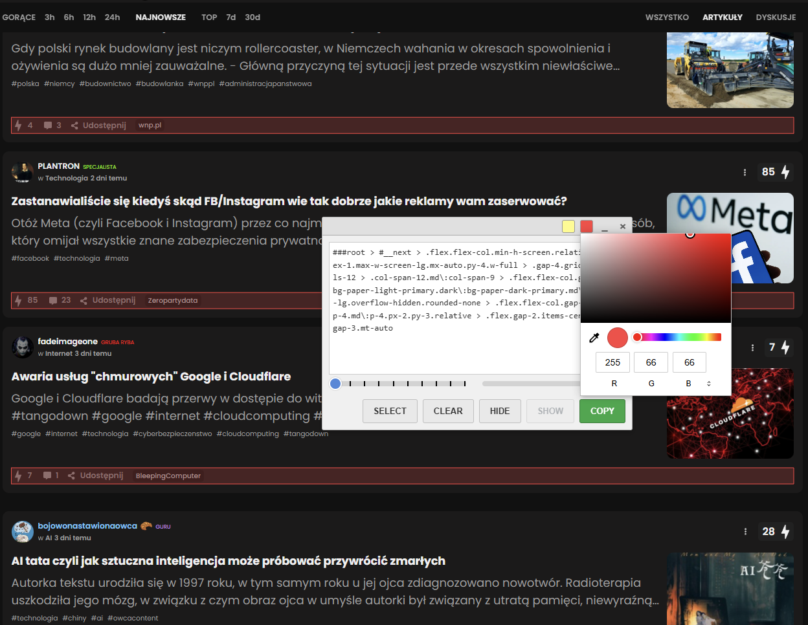
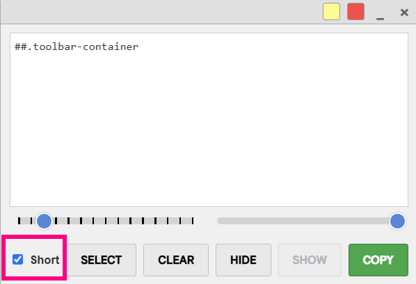
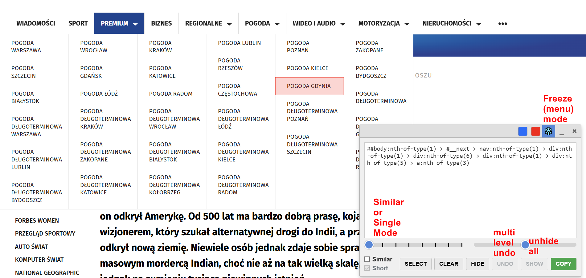
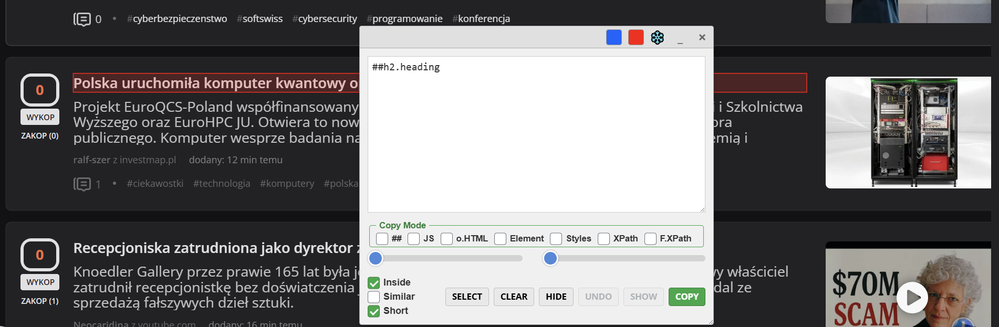
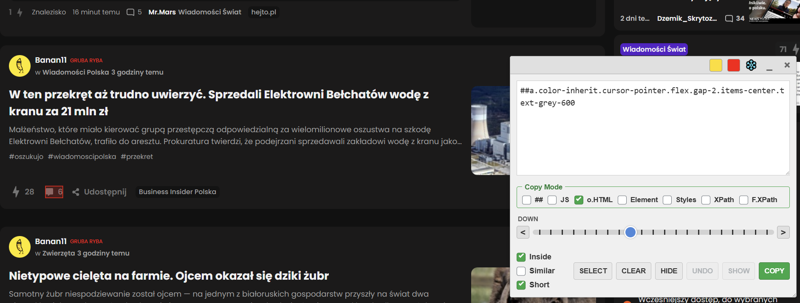
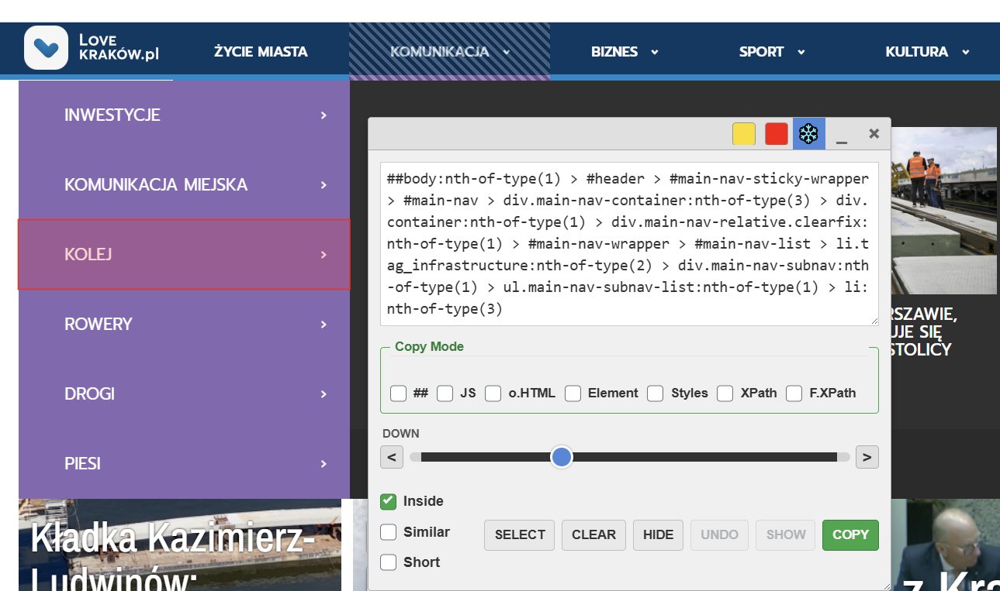
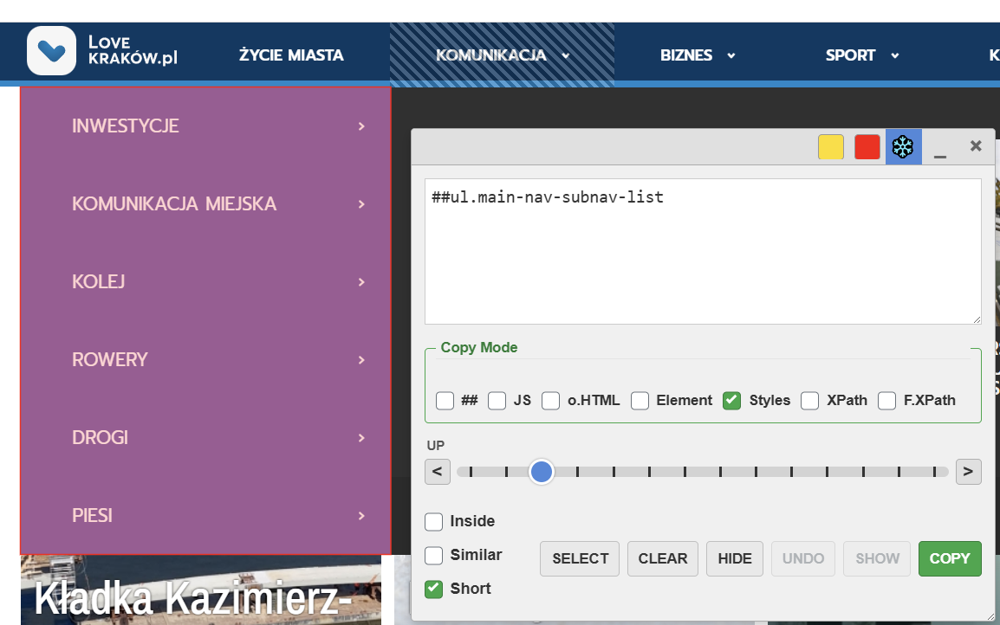

# Select Element - Chrome extension.
Select element on page, show info class ID root, hide element, copy selector to clipboard.
 
 
 

### v2.1 

add "Short" option.

### v2.2 

-more precise selection. 

-option to select individual or similar elements

-multi-level undo hiding

-moving through the element tree with sliders

-option to freeze the menu

# v2.3

### FIX working on some pages. (ex. Google Maps)

# v2.4 change in the method of operation/selection of sliders

2 method block menu: JS (default) and CSS menu.

fix on some pages with wrong html menu (non-standard)

# v2.5 Another change to the selection method, added mode for searching within an element and copying properties

 
 
 
# v2.6 Another change to the selection method.  
Simplified logic of the Up and DOWN modes.  

  

### freeze menu mode:
  
 
 
 
    

# v2.7 add Manual Selector Input  
 
 
 
 
 
 
***

# Select Element

**Select Element** is a powerful browser extension for developers, testers, and content creators. It provides an advanced interface for selecting web page elements, generating precise CSS selectors, and interacting with them in various ways. Its key strength lies in its ability to work seamlessly across iframes and handle dynamic, hard-to-click elements.

This tool is heavily inspired by the element picker found in uBlock Origin, but rebuilt as a standalone extension with additional features for developers.

## ✨ Key Features

*   **Interactive Element Selection:** Visually select any element on a page with your mouse.
*   **Advanced Selector Generation:** Fine-tune selectors using an intuitive slider and modifier checkboxes.
*   **Full Iframe Support:** Select elements inside nested iframes without any extra steps. The tool automatically handles communication between frames.
*   **Dynamic Content Freezing:** "Freeze" dropdown menus or hover-activated elements to make them selectable.
*   **Live Element Manipulation:** Temporarily hide elements on the page to test layout changes.
*   **Multiple Copy Formats:** Copy the generated selector as a standard CSS filter, a JavaScript query, XPath, or copy the element's `outerHTML` and computed styles.
*   **Customizable UI:** Change the highlight colors to your preference. The panel is draggable and resizable.

## 🚀 Installation

1.  Clone this repository or download it as a ZIP file.
2.  Open Google Chrome and navigate to `chrome://extensions`.
3.  Enable "Developer mode" in the top-right corner.
4.  Click "Load unpacked" and select the directory where you saved the extension files.
5.  The Element Picker icon will appear in your browser's toolbar.

## 📖 How to Use

1.  Navigate to the webpage where you want to select an element.
2.  Click the Element Picker icon in your browser's toolbar.
3.  The page will enter "picker mode." Your cursor will change to a crosshair, and a semi-transparent overlay will cover the page.
4.  Hover over elements to see them highlighted in blue (by default).
5.  Click on an element to "select" it. This will pause the picker and open the main control panel.

## 🎛️ The Control Panel Explained

Once an element is selected, the control panel appears, giving you full control over the selector generation.

### Selector Generation Controls

This is the core of the tool. These controls allow you to precisely define the selector you need.

#### The Slider (UP / DOWN)

The slider is the primary tool for traversing the DOM tree relative to the element you clicked. Its behavior is controlled by the `Inside` checkbox.

*   **UP Mode (`Inside` checkbox is OFF):**
    *   This is the default mode. The slider allows you to **traverse up the DOM tree** from your selected element to its parents.
    *   When the slider is at `0`, it targets the element you clicked.
    *   As you move the slider to the right, the selection expands to include the parent, then the grandparent, and so on. This is useful for selecting a container when you've clicked a specific item inside it.
    *   The label next to the slider will read **UP**.

*   **DOWN Mode (`Inside` checkbox is ON):**
    *   This mode allows you to **traverse down into the descendants** of the currently selected element.
    *   It uses a TreeWalker to find all child elements and text nodes.
    *   The slider lets you step through each of these descendants one by one. This is useful for targeting a very specific child element within a larger component you've already selected.
    *   The label next to the slider will read **DOWN**.

#### The Checkboxes

These checkboxes modify the behavior of the slider and the final generated selector.

*   ✅ **`Inside`**
    *   **Function:** Toggles the slider's behavior between **UP Mode** and **DOWN Mode**.
    *   **When unchecked (default):** The slider moves up to parent elements.
    *   **When checked:** The slider moves down to child elements.

*   ✅ **`Similar`**
    *   **Function:** Toggles between selecting a single, specific element and selecting multiple, similar elements.
    *   **When unchecked (default):** The tool uses a highly specific selector (e.g., ``div#main > ul.menu > li:nth-of-type(3)``) to target *only* the element you are focused on. The highlight will be on a single element.
    *   **When checked:** The tool generates a more generic selector (e.g., `.menu-item`) that may match multiple elements on the page. All matching elements will be highlighted. This is perfect for creating rules that apply to all similar items in a list or grid.

*   ✅ **`Short`**
    *   **Function:** Controls the verbosity of the selector **displayed in the text box**.
    *   **When unchecked (default):** The text box shows the full, precise selector path (e.g., ``body > div#app > section.content``).
    *   **When checked:** The text box shows a shorter, more concise version of the selector, usually just for the final element in the path (e.g., `section.content`). This is a cosmetic change to make the selector easier to read, while the underlying selection logic still respects the `Similar` checkbox.

### ❄️ The Freeze Function

Dynamic web pages often have elements, like navigation menus, that appear on hover and disappear when you try to move your mouse to click them. The Freeze function is designed to solve this problem.

It has two modes:

1.  **JS Freeze (Click the `❄️` button):**
    *   **What it does:** This mode blocks common JavaScript events that cause elements to hide, such as `mouseout`, `mouseleave`, `blur`, and `focusout`.
    *   **How to use:** If a menu disappears when you move your mouse away, click the `❄️` button to activate the freeze. The icon will turn blue. Now, activate the menu (e.g., by hovering over its trigger). It should stay visible, allowing you to click on its items with the picker.
    *   Click the `❄️` button again to disable it.

2.  **CSS Freeze (Press the `Z` key):**
    *   **What it does:** This mode is for elements that are revealed using CSS `:hover` pseudo-classes. It takes a "snapshot" of the computed styles of a hovered element and applies them inline, forcing it to stay visible.
    *   **How to use:** Hover over the parent element that triggers the menu to appear (e.g., the `<li>` in a navigation bar). While the menu is visible, press the `Z` key. The menu will be "frozen" in place, and a striped overlay will appear over the area to indicate it's frozen. You can now freely move your mouse and select items from it.
    *   Press `Z` again to unfreeze.

### Other Controls

*   **Selector Display:** A text area showing the currently generated selector. You can also manually edit it.
*   **Copy Mode:** A set of radio buttons to choose the format for the clipboard:
    *   `##`: A standard ad-blocker filter format (e.g., `##div.ad-banner`).
    *   `JS`: A JavaScript `querySelector` string.
    *   `o.HTML` / `Element`: The element's `outerHTML`.
    *   `Styles`: A detailed list of the element's computed CSS styles, similar to the browser's dev tools.
    *   `XPath` / `F.XPath`: The element's relative or full XPath.
*   **Action Buttons:**
    *   `SELECT`: Exits the control panel and returns to picker mode to select a new element.
    *   `CLEAR`: Clears the current selection and resets the panel.
    *   `HIDE`: Applies `display: none !important;` to the current selector, hiding the element(s).
    *   `UNDO`: Reverts the last `HIDE` action.
    *   `SHOW`: Reverts all `HIDE` actions performed in the current session.
    *   `COPY`: Copies the selector to the clipboard in the chosen format.
 
**Feature Name:** Manual Selector Input

**Purpose:** To allow the user to manually type or paste a CSS selector directly into the extension's panel and then treat the found element as if it were clicked by the mouse in picker mode.

**How it works:**

1.  The user activates the extension.
2.  In the panel's top text area (`#ubo-picker-filter-display`), the user can type any valid CSS selector.
3.  After typing the selector, the user presses the `Enter` key.

**Behavior upon pressing `Enter`:**

*   **Success (element found):**
    *   The extension searches the page for the first element that matches the provided selector.
    *   If an element is found, the extension enters the "paused" state, exactly as it would after a mouse click on an element.
    *   A full DOM path (`fullSelectorPath`) to this element is generated.
    *   All panel controls (the DOM traversal slider, `Inside`, `Similar`, `Short` checkboxes) become active and operate in the context of the found element, allowing for further manipulation and final selector generation.
    *   The selection highlight correctly follows the element on page scroll.

*   **No Matches:**
    *   If the provided selector is syntactically correct but does not match any element on the page, the text area is highlighted with an orange border and a `(0 matches)` message is displayed.
    *   The extension returns to the active picking mode (crosshair cursor), allowing the user to select an element with the mouse again.

*   **Invalid Selector:**
    *   If the entered text is not a valid CSS selector (syntax error), the text area is highlighted with a red border to signal the error. No further action is taken.

---

**Select Element** 
to zaawansowane rozszerzenie przeglądarki dla deweloperów, testerów i twórców treści. Dostarcza zaawansowany interfejs do wybierania elementów na stronie internetowej, generowania precyzyjnych selektorów CSS i interakcji z nimi na różne sposoby. Jego kluczową zaletą jest zdolność do płynnej pracy wewnątrz ramek `iframe` oraz obsługa dynamicznych, trudnych do kliknięcia elementów.

Narzędzie jest mocno inspirowane próbnikiem elementów z rozszerzenia uBlock Origin, ale zostało stworzone od nowa jako samodzielne rozszerzenie z dodatkowymi funkcjami dla deweloperów.

## ✨ Kluczowe Funkcje

*   **Interaktywne Wybieranie Elementów:** Wizualnie zaznacz dowolny element na stronie za pomocą myszy.
*   **Zaawansowane Generowanie Selektorów:** Dostosuj selektory za pomocą intuicyjnego suwaka i modyfikujących pól wyboru.
*   **Pełne Wsparcie dla Iframe:** Wybieraj elementy w zagnieżdżonych ramkach `iframe` bez żadnych dodatkowych kroków. Narzędzie automatycznie zarządza komunikacją między ramkami.
*   **Zamrażanie Dynamicznej Treści:** "Zamrażaj" rozwijane menu lub elementy aktywowane przez najechanie myszą, aby można było je zaznaczyć.
*   **Manipulacja Elementami na Żywo:** Tymczasowo ukrywaj elementy na stronie, aby testować zmiany w układzie.
*   **Wiele Formatów Kopiowania:** Skopiuj wygenerowany selektor jako standardowy filtr CSS, zapytanie JavaScript, XPath, lub skopiuj `outerHTML` i obliczone style elementu.
*   **Dostosowywalny Interfejs:** Zmień kolory podświetlenia według własnych preferencji. Panel można przesuwać i zmieniać jego rozmiar.

## 🚀 Instalacja

1.  Sklonuj to repozytorium lub pobierz je jako plik ZIP.
2.  Otwórz Google Chrome i przejdź do `chrome://extensions`.
3.  Włącz "Tryb dewelopera" w prawym górnym rogu.
4.  Kliknij "Załaduj rozpakowane" i wybierz katalog, w którym zapisałeś pliki rozszerzenia.
5.  Ikona Element Picker pojawi się na pasku narzędzi przeglądarki.

## 📖 Jak Używać

1.  Przejdź na stronę internetową, na której chcesz wybrać element.
2.  Kliknij ikonę Element Picker na pasku narzędzi przeglądarki.
3.  Strona przejdzie w "tryb próbnika". Kursor zmieni się w celownik, a na stronie pojawi się półprzezroczysta nakładka.
4.  Najeżdżaj na elementy, aby zobaczyć, jak są podświetlane (domyślnie na niebiesko).
5.  Kliknij element, aby go "wybrać". Spowoduje to wstrzymanie próbnika i otwarcie głównego panelu sterowania.

## 🎛️ Objaśnienie Panelu Sterowania

Po wybraniu elementu pojawia się panel sterowania, dający pełną kontrolę nad generowaniem selektora.

### Kontrolki Generowania Selektora

To jest serce narzędzia. Te kontrolki pozwalają precyzyjnie zdefiniować potrzebny selektor.

#### Suwak (UP / DOWN)

Suwak jest głównym narzędziem do poruszania się po drzewie DOM względem klikniętego elementu. Jego zachowanie jest kontrolowane przez pole wyboru `Inside`.

*   **Tryb UP (`Inside` jest odznaczone):**
    *   To jest tryb domyślny. Suwak pozwala na **przechodzenie w górę drzewa DOM** od wybranego elementu do jego rodziców.
    *   Gdy suwak jest na pozycji `0`, wskazuje na kliknięty element.
    *   W miarę przesuwania suwaka w prawo, zaznaczenie rozszerza się na rodzica, potem dziadka itd. Jest to przydatne do wybrania kontenera, gdy kliknęło się w konkretny element wewnątrz niego.
    *   Etykieta obok suwaka będzie miała napis **UP**.

*   **Tryb DOWN (`Inside` jest zaznaczone):**
    *   Ten tryb pozwala na **przechodzenie w dół do potomków** aktualnie wybranego elementu.
    *   Używa on `TreeWalker` do znalezienia wszystkich elementów podrzędnych i węzłów tekstowych.
    *   Suwak pozwala przechodzić przez każdego z tych potomków jeden po drugim. Jest to przydatne do precyzyjnego namierzenia elementu podrzędnego w większym komponencie, który już został wybrany.
    *   Etykieta obok suwaka będzie miała napis **DOWN**.

#### Pola Wyboru (Checkboxy)

Te pola modyfikują zachowanie suwaka oraz ostateczny, wygenerowany selektor.

*   ✅ **`Inside`**
    *   **Funkcja:** Przełącza zachowanie suwaka między trybem **UP** a trybem **DOWN**.
    *   **Gdy odznaczone (domyślnie):** Suwak porusza się w górę do elementów nadrzędnych.
    *   **Gdy zaznaczone:** Suwak porusza się w dół do elementów podrzędnych.

*   ✅ **`Similar`**
    *   **Funkcja:** Przełącza między wybieraniem pojedynczego, konkretnego elementu a wybieraniem wielu, podobnych elementów.
    *   **Gdy odznaczone (domyślnie):** Narzędzie używa bardzo specyficznego selektora (np. ``div#main > ul.menu > li:nth-of-type(3)``), aby wskazać *tylko* element, na którym się skupiasz. Podświetlony będzie jeden element.
    *   **Gdy zaznaczone:** Narzędzie generuje bardziej ogólny selektor (np. `.menu-item`), który może pasować do wielu elementów na stronie. Wszystkie pasujące elementy zostaną podświetlone. Jest to idealne do tworzenia reguł, które mają dotyczyć wszystkich podobnych elementów na liście lub w siatce.

*   ✅ **`Short`**
    *   **Funkcja:** Kontroluje szczegółowość selektora **wyświetlanego w polu tekstowym**.
    *   **Gdy odznaczone (domyślnie):** Pole tekstowe pokazuje pełną, precyzyjną ścieżkę selektora (np. ``body > div#app > section.content``).
    *   **Gdy zaznaczone:** Pole tekstowe pokazuje krótszą, bardziej zwięzłą wersję selektora, zazwyczaj tylko dla ostatniego elementu w ścieżce (np. `section.content`). Jest to zmiana kosmetyczna, aby selektor był łatwiejszy do odczytania, podczas gdy podstawowa logika zaznaczania nadal respektuje pole `Similar`.

### ❄️ Funkcja Zamrażania (Freeze)

Dynamiczne strony internetowe często posiadają elementy, takie jak menu nawigacyjne, które pojawiają się po najechaniu myszą i znikają, gdy próbujesz przesunąć kursor, aby je kliknąć. Funkcja "Freeze" została zaprojektowana, aby rozwiązać ten problem.

Posiada ona dwa tryby:

1.  **Zamrażanie JS (Kliknij przycisk `❄️`):**
    *   **Co robi:** Ten tryb blokuje popularne zdarzenia JavaScript, które powodują ukrywanie elementów, takie jak `mouseout`, `mouseleave`, `blur` i `focusout`.
    *   **Jak używać:** Jeśli menu znika, gdy odsuwasz od niego mysz, kliknij przycisk `❄️`, aby aktywować zamrażanie. Ikona zmieni kolor na niebieski. Teraz aktywuj menu (np. najeżdżając na jego wyzwalacz). Powinno ono pozostać widoczne, pozwalając na kliknięcie jego elementów za pomocą próbnika.
    *   Kliknij przycisk `❄️` ponownie, aby je wyłączyć.

2.  **Zamrażanie CSS (Naciśnij klawisz `Z`):**
    *   **Co robi:** Ten tryb jest przeznaczony dla elementów, które są odsłaniane za pomocą pseudoklasy CSS `:hover`. Robi "migawkę" obliczonych stylów elementu po najechaniu i stosuje je bezpośrednio w atrybucie `style`, zmuszając go do pozostania widocznym.
    *   **Jak używać:** Najedź kursorem na element nadrzędny, który wyzwala pojawienie się menu (np. `<li>` w pasku nawigacji). Gdy menu jest widoczne, naciśnij klawisz `Z`. Menu zostanie "zamrożone" na swoim miejscu, a na jego obszarze pojawi się nakładka w paski, aby zasygnalizować, że jest zamrożone. Możesz teraz swobodnie przesuwać mysz i wybierać z niego elementy.
    *   Naciśnij `Z` ponownie, aby odmrozić.

### Pozostałe Kontrolki

*   **Wyświetlacz Selektora:** Pole tekstowe pokazujące aktualnie wygenerowany selektor. Można go również ręcznie edytować.
*   **Tryb Kopiowania:** Zestaw przycisków radiowych do wyboru formatu kopiowania do schowka:
    *   `##`: Standardowy format filtra dla blokerów reklam (np. `##div.ad-banner`).
    *   `JS`: Ciąg znaków dla `querySelector` w JavaScript.
    *   `o.HTML` / `Element`: `outerHTML` elementu.
    *   `Styles`: Szczegółowa lista obliczonych stylów CSS elementu, podobna do narzędzi deweloperskich przeglądarki.
    *   `XPath` / `F.XPath`: Względny lub pełny XPath elementu.
*   **Przyciski Akcji:**
    *   `SELECT`: Zamyka panel sterowania i wraca do trybu próbnika, aby wybrać nowy element.
    *   `CLEAR`: Czyści bieżące zaznaczenie i resetuje panel.
    *   `HIDE`: Stosuje `display: none !important;` do bieżącego selektora, ukrywając element(y).
    *   `UNDO`: Cofa ostatnią akcję `HIDE`.
    *   `SHOW`: Cofa wszystkie akcje `HIDE` wykonane w bieżącej sesji.
    *   `COPY`: Kopiuje selektor do schowka w wybranym formacie.
 
 
**Nazwa funkcji:** Ręczne Wprowadzanie Selektora

**Cel:** Umożliwienie użytkownikowi ręcznego wpisania lub wklejenia selektora CSS bezpośrednio do panelu rozszerzenia, a następnie potraktowanie znalezionego elementu tak, jakby został on kliknięty myszą w trybie wyboru.

**Jak to działa:**

1.  Użytkownik aktywuje rozszerzenie.
2.  W panelu, w górnym polu tekstowym (`#ubo-picker-filter-display`), użytkownik może wpisać dowolny, poprawny selektor CSS.
3.  Po wpisaniu selektora, użytkownik naciska klawisz `Enter`.

**Scenariusze działania po naciśnięciu `Enter`:**

*   **Sukces (znaleziono element):**
    *   Rozszerzenie wyszukuje na stronie pierwszy element, który pasuje do podanego selektora.
    *   Jeśli element zostanie znaleziony, rozszerzenie przechodzi w stan "wstrzymania" (`paused`), dokładnie tak, jak po kliknięciu elementu myszą.
    *   Generowana jest pełna ścieżka (`fullSelectorPath`) do tego elementu.
    *   Wszystkie kontrolki panelu (suwak do nawigacji w drzewie DOM, checkboxy `Inside`, `Similar`, `Short`) stają się aktywne i działają w kontekście znalezionego elementu, pozwalając na dalszą manipulację i generowanie docelowego selektora.
    *   Podświetlenie selekcji poprawnie reaguje na przewijanie strony.

*   **Brak dopasowań:**
    *   Jeśli podany selektor jest poprawny składniowo, ale nie znajduje żadnego elementu na stronie, pole tekstowe zostaje podświetlone na pomarańczowo i wyświetlony zostaje komunikat `(0 matches)`.
    *   Rozszerzenie powraca do trybu aktywnego wyboru (kursor w kształcie krzyżyka), umożliwiając ponowny wybór elementu myszą.

*   **Nieprawidłowy selektor:**
    *   Jeśli wpisany tekst nie jest prawidłowym selektorem CSS (błąd składni), pole tekstowe zostaje podświetlone na czerwono, sygnalizując błąd. Dalsze akcje nie są podejmowane.
    *   
